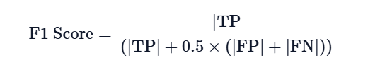
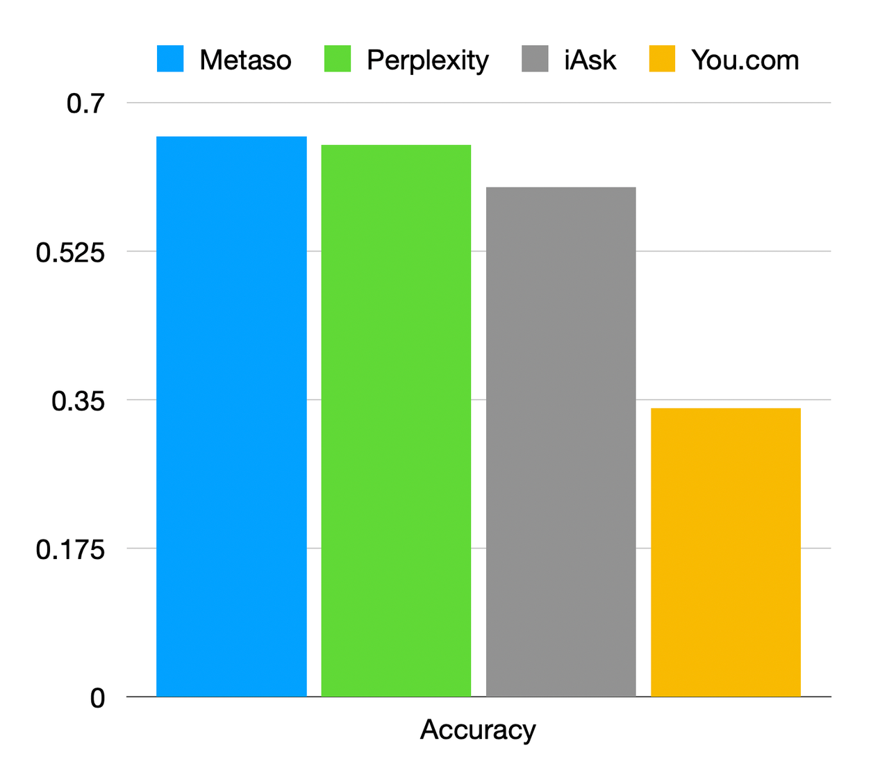
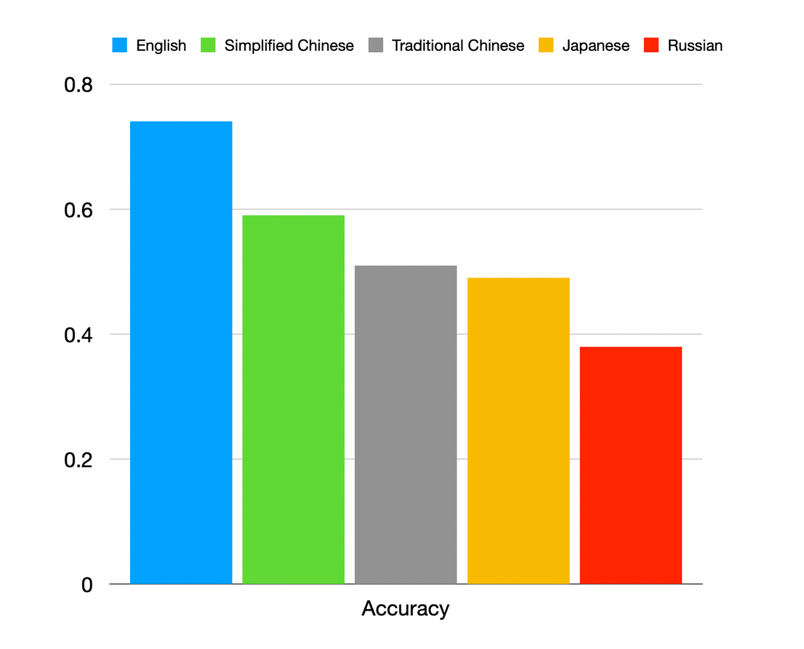
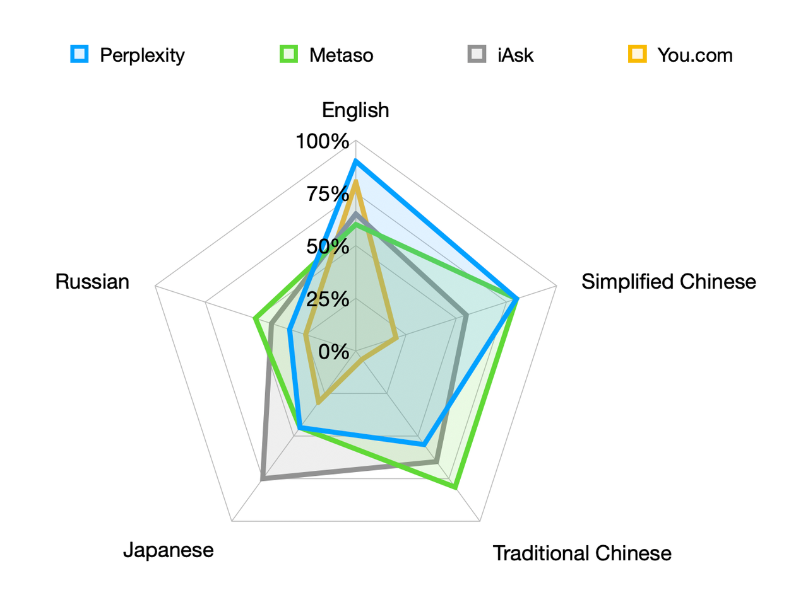

# ASEED

ASEED (AI Search Engine Evaluation Dataset) is a dataset rewritten based on real user search scenarios, which is used to evaluate the question-answering quality of current mainstream AI search engines.

## Intruduction

We plan to create a standardized and comprehensive dataset to evaluate AI search engines comprehensively and accurately. Considering the language diversity of the global user community, our evaluation report covers multiple languages including English, Japanese, Simplified Chinese, Russian, and Traditional Chinese, and has conducted preliminary testing and evaluation on the accuracy of these question-answering search engine products.

## Leader Board（5/1/2024)

| Product Name | Accuracy | Answer correctness |
| --- | --- | --- |
| Metaso | 66.00% | 62.70% |
| Perplexity | 65.00% | 65.22% |
| iAsk | 60.00% | 62.27% | 
| You.com | 34.00 | 58.27% |

 

## Dataset

**Scenario Distribution**

|Search Scenario    | Number of Cases | Percentage of Total |
| ----------------- | ------------- | ------------- |
| Technical Consulting       | 20     | 20%   |
| Real-Time News       | 20     | 20%   |
| Local Search       | 20     | 20%   |
| Product Search       | 20     | 20%   |
| Business Consulting       | 20     | 20%   |
| **Total** | **100** | **100%** |

 

**Language Distribution**

| Evaluation Languages     |Language Proportion |
| ----------------- | ------------- |
| English       | 20%     |
| Japanese       | 20%     |
| Simplified Chinese       | 20%     |
| Traditional Chinese       | 20%     |
| Russian       | 10%     |
| Korean       | 10%     |
| **Total** | **100%** |

 

**Data Sample**

id|query|ground_truth|expect_key_words|language|description
---|---|---|---|---|---
1|What is Toyota's biggest risk in the future?|Toyota's biggest risk in the future is the consumer adoption of battery electric vehicles (BEVs)|BEVs\|\|EV\|\|Tesla\|\|Evs|en|-|
2|海康威視去年的業績如何|在2023年，海康威視的業績恢復增長，公司實現了營業收入893.55億元，同比增長7.44%，淨利潤為141.17億元，同比增長9.96%。|2023 893|zh_tw|-|
3|最近の台湾の地震での死傷者数は何人ですか?|台灣花蓮地震死亡數字上升。10日救援人員在花蓮太魯閣區域砂卡礑步道尋獲3具遺體，花蓮7.3級地震罹難人數上升至16人。|16|ja|-|

 

## Evaluation Method and Results

**Testing Method**
  - **Accuracy**：Manual Evaluation

    The actual answers are manually compared with the Ground truth and Key words. If the answer is a match or relevant, it is marked as "True"; otherwise, it is "False".
  
  - **Answer Correctness**: GPT-4 Scoring

    The Answer correctness metric from the Ragas platform, with the GPT-4-Turbo model being used for evaluation. The formula for calculating “Answer correctness” is as follows.
    
     

    (Metric Description：
    [https://docs.ragas.io/en/latest/concepts/metrics/answer_correctness.html](https://docs.ragas.io/en/latest/concepts/metrics/answer_correctness.html))

     

**Evaluation Metrics**
| Metric     | Definition of Evaluation | Advantages |
| ----------------- | ------------- | ------------- |
| Accuracy       | Manual evaluation of the actual answers based on Ground truth and key words     | Precise assessment|
| Answer correctness        | GPT-4 comparison of Ground truth with actual answers     | Less labor-intensive|

 

**Product Selection**

To conduct this performance evaluation of question-answering search engines, we referred to the list of leading AI search engine products provided by the [aicpb.com](https://dnipkggqxh.feishu.cn/wiki/YTIUwM6Vmij4IQkSm9PctPWunIb) website. After excluding traditional keyword search engines, we carefully selected four of the most outstanding AI question-answering search engine products on the market for our evaluation.

The specific information about the aforementioned four products is as follows (referenced from statistics at [aicpb.com](https://dnipkggqxh.feishu.cn/wiki/YTIUwM6Vmij4IQkSm9PctPWunIb)):

| Rank | Product Name | Category | Monthly Visits (March) | MoM Change |
| --- | --- | --- | --- | --- |
| 2 | Perplexity | AI Search Engine | 64.14M | 25.17% |
| 3 | You.com | AI Search Engine | 10.44M | 14.61% |
| 5 | Metaso | AI Search Engine | 7.21M | 551.36% |
| 7 | iAsk | AI Search Engine | 3.43M | 15.43% |

 

**Detailed test results**

- Overall, the performance of the evaluated products did not meet our expectations. However, it is noteworthy that Metaso, a company primarily serving the Chinese market, performed the best overall in the evaluation, slightly surpassing Perplexity.

 
 

- The comprehensive data analysis of all products indicates that the highest accuracy is achieved in answering questions in English. By contrast, Russian questions have the lowest accuracy rate, and the accuracy for Japanese questions is also relatively low.

 
 

- In terms of performance by language, Perplexity leads by a significant margin in answering English questions, and its performance in Simplified Chinese is also quite impressive. Metaso stands out in its performance in both Simplified and Traditional Chinese. However, both companies did not reach a satisfactory level in other languages. iAsk demonstrated relatively balanced capabilities across different languages, but overall, it falls within the medium range. You.com, on the other hand, performed well only in answering questions in English.

 

 

## Future plans
In the future, we plan to expand our evaluation test set, adding more languages and query scenarios to provide a more comprehensive and detailed performance assessment. We believe that with technological advancements and the enrichment of datasets, AI question-answering search engines will be able to better meet the diverse needs of global users and play an even more important role in the future of search technology.
 

## Acknowledgments
We are very grateful to [Ragas](https://docs.ragas.io) for providing the scoring system.

